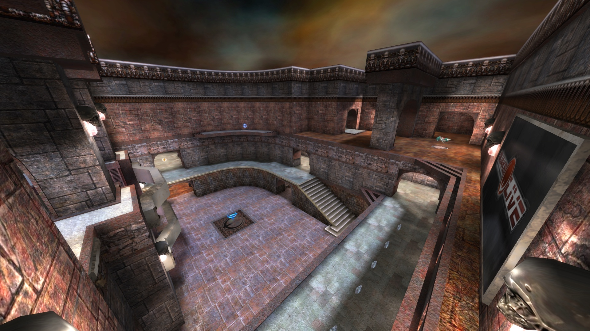
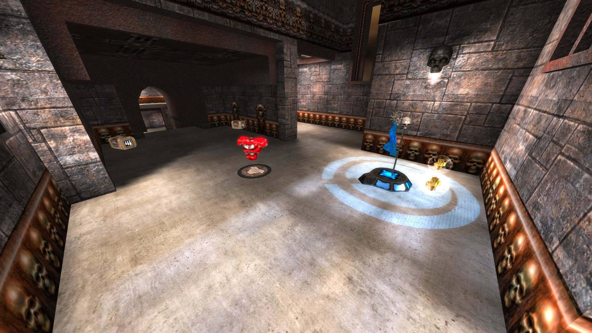
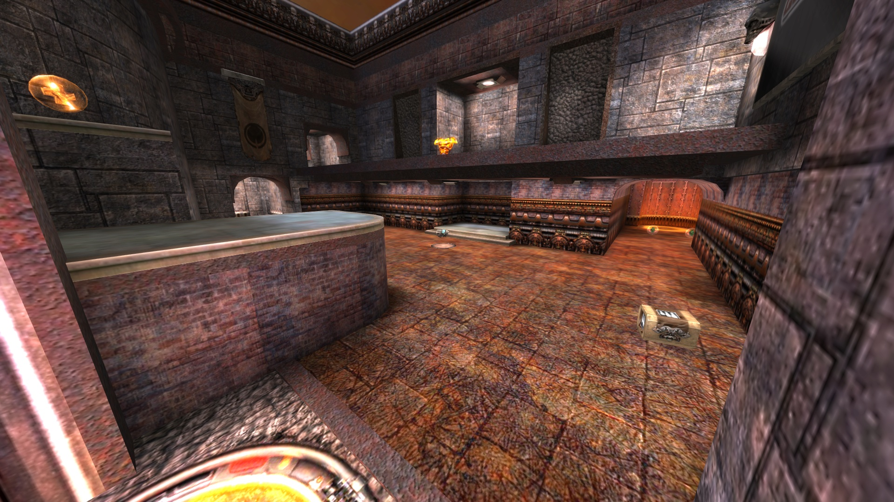
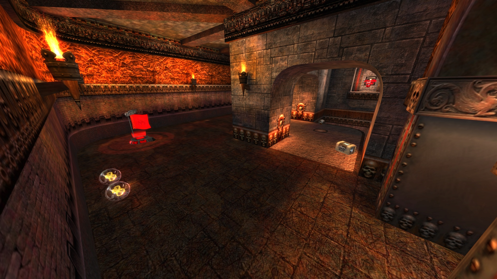
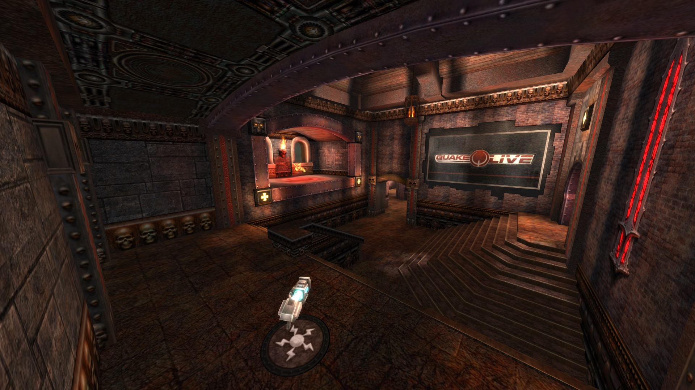
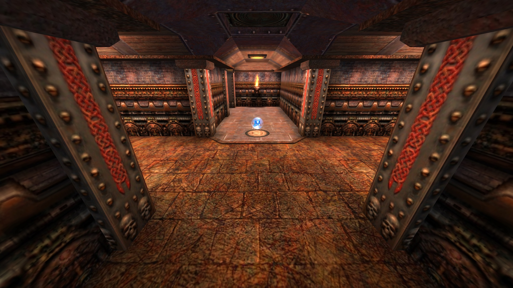
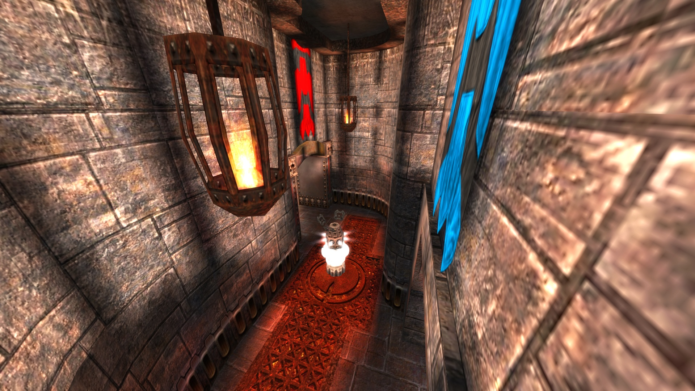

# Almost Run

This repository contains the QuakeLive map, which is a merge of Almost Lost and Blood Run.

## Downloads

The compiled version is available in the [Release section](https://github.com/abe-pl/almostrun/releases)

## Screenshots

## Details

Maps were imported from .bsp files and edited using [NetRadiant-custom](https://github.com/Garux/netradiant-custom)\
All game modes are supported including CTF, One Flag, Harvester (except Race)\
To build, check make.bat script

## Credits

* idSoftware for Almost Lost
* Sten "ztn" Uusvali for Blood Run
